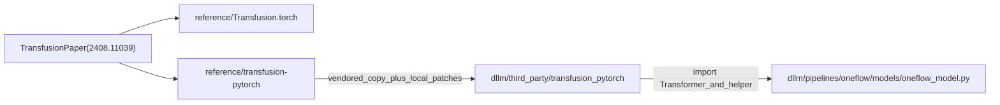
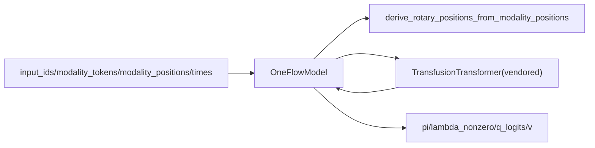

# Transfusion 三仓实现对比与取舍解析（中文）

本文对比三个实现：

- `reference/Transfusion.torch`
- `reference/transfusion-pytorch`
- `dllm/third_party/transfusion_pytorch`

并结合 `dllm/pipelines/oneflow/models/oneflow_model.py` 说明当前 OneFlow 实际复用了什么、为什么看起来复杂、复杂度收益与代价各是什么。

---

## 1. 结论先行（TL;DR）

- `Transfusion.torch` 是**教学/实验原型**：结构短平快，便于理解，但功能边界明显（text+image 两模态、unbatched 主路径、DDPM 风格 image 采样）。
- `transfusion-pytorch` 是**通用研究框架**：能力最全（多模态、flow matching、CFG、velocity consistency、modality-only/text-only 训练与采样），但代码和概念复杂度最高。
- `dllm/third_party/transfusion_pytorch` 是**为 OneFlow 集成做的裁剪版 vendoring**：核心是保留上游 trunk 能力，并针对本仓库训练/采样路径做了少量关键改动（最重要的是 manual `attn_mask` 支持，移除了上游 CFG 相关分支）。
- 当前 OneFlow 并没有使用 vendored `Transfusion` 整套范式，而是只取了 `Transformer` trunk 与 `derive_rotary_positions_from_modality_positions()`，然后在外层实现自己的 `pi/lambda/Q/v` heads 与 loss。

---

## 2. 三仓关系图

---

## 3. 模型设计对比（模块级）

| 维度 | `Transfusion.torch` | `transfusion-pytorch` | `dllm/third_party/transfusion_pytorch` |
|---|---|---|---|
| 主干结构 | LLaMA 风格 `Transformer`（`src/llama2c.py`）+ 外层 `Transfussion` 包装 | 自带 `Transformer` + `AdaptiveWrapper` + hyper-connections + modality-aware masking | 基本继承上游同结构 |
| 时间条件 | `PatchOps` 对 image patch 加 `TimeEmbedding`（sinusoidal+MLP） | `RandomFourierEmbed` + `to_time_cond`，并由 `AdaptiveWrapper` 分别调制 text/modality | 同上游 |
| 注意力掩码 | `_compute_mask()`：文本因果、图像块内双向（手工拼 mask） | `transfusion_attn_mask()`/`naive_attn_mask()`，支持 modality positions 与 flex attention | 同上游，但额外支持 manual `attn_mask` 路径 |
| 模态表达 | 文本 embedding + patchify 后线性映射 | 多模态统一抽象（modality type、encoder/decoder、shape meta tokens、axial pos emb） | 同上游（完整类仍在） |
| 输出 heads | `lm_emb_linear`（text）+ `img_patch_linear`（image） | text logits + flow 相关输出（按 modality 解析） | 同上游；但 OneFlow 集成并不直接调用这些上层接口 |
| 代码体量（单文件） | `289` 行 | `2949` 行 | `2870` 行 |

> 体量只是粗指标，但能直观看到：`Transfusion.torch` 更像“核心想法演示”，后两者是“可扩展研究框架”。

---

## 4. 训练/采样范式对比（功能级）

### 4.1 `reference/Transfusion.torch`

- 训练目标是“文本 AR + 图像扩散”混合：
  - 文本：常规 CE（README 描述）
  - 图像：DDPM 风格噪声预测 + MSE（`src/diffusion_utils.py`）
- 推断流程是递归交替：
  - `lm_mode()` 生成文本，遇到 `BOI` 切到 `diff_mode()`
  - `diff_mode()` 调 `DiffusionUtils.generate()` 迭代去噪图像，再回到 `lm_mode()`
- 特征：
  - 教学清晰
  - 但批处理与工程可扩展性有限（核心路径是 `forward_unbatched()`）

### 4.2 `reference/transfusion-pytorch`

- 支持更完整的 Transfusion/Transflow 研究能力：
  - 多模态统一输入抽象（`ModalitySample`）
  - text-only / modality-only / mixed 路径
  - flow matching + velocity consistency + optional reconstruction loss
  - 采样期 CFG（`sample(..., cfg_scale=...)`）与训练期 `prob_uncond` 分支
- `Transformer` 层面能力更强：
  - `AdaptiveWrapper` 对 text 与 modality 采用不同调制路径
  - hyper-connections、UNet-like skip、value residual、可选 flex attention

### 4.3 `dllm/third_party/transfusion_pytorch`

- 不是“重写”，而是“上游副本 + 小范围 patch”。
- 保留了上游大多数结构与 API，但做了 OneFlow 集成导向改动（见下一节）。

---

## 5. Vendored 相对上游的关键改动（代码证据）

下表是对功能有语义影响的关键差异：

| 变更点 | 上游 | vendored | 影响 |
|---|---|---|---|
| manual `attn_mask` 路径 | 默认不单独透传（主要走 `modality_positions`） | 在 `Transformer.forward()` 中显式支持 `attn_mask`，并加注释说明用途 | 允许 OneFlow 用 padding mask 直接控制注意力（text-only/mixed 都更易对接） |
| 训练期 CFG 参数 | `Transfusion.__init__` 有 `prob_uncond`，`forward()` 有 `prob_uncond` 覆盖逻辑 | 相关参数与分支移除 | 降低分支复杂度，行为更确定 |
| 采样期 CFG 参数 | `sample(..., cfg_scale=3.)` + 条件/无条件双前向融合 | `cfg_scale` 参数移除，相关逻辑移除 | 减少采样路径复杂度与开销 |
| `null_text_id` 相关 | 定义并用于无条件文本替换 | 移除 | 与 CFG 逻辑一起简化 |
| text loss 过滤项 | 过滤 `null_text_id` 标签 | 对应过滤移除 | 因为 `null_text_id` 与 CFG 路径已移除 |

同时也有“工程性改动”：

- 文件头增加 vendoring 与 license 归属说明；
- `hyper_connections` 的导入路径调整为本仓库可用形式；
- `dllm/third_party/transfusion_pytorch/__init__.py` 只导出 `Transformer` 别名（`TransfusionTransformer`）。

---

## 6. OneFlow 实际使用的是 vendored 的哪一部分

`OneFlowModel` 仅导入两项：

- `Transformer as TransfusionTransformer`
- `derive_rotary_positions_from_modality_positions`

然后在外层自己做：

- text embedding / latent projection
- `pi`, `lambda_nonzero`, `q_logits`, `v` 四个 heads
- 训练损失与采样逻辑（在 OneFlow pipeline 内实现）

也就是说，当前 OneFlow 取的是“**Transfusion trunk 能力**”，不是“整套 Transfusion 上层范式”。

---

## 7. 为什么研发时选择更复杂的 Transfusion 设计

结合 `doc/oneflow/design/oneflow_design_zh.md` 的目标，核心原因不是“为了复杂而复杂”，而是为了满足这些刚需：

1. **统一序列建模**  
   文本 token 与图像 latent token 要在同一 trunk 中交错处理。

2. **模态感知的注意力与位置机制**  
   需要 `modality_positions` 驱动的 mixed mask 与 rotary relative position 规则。

3. **每 token 时间条件**  
   文本与图像 token 的时间条件可能不同，需在 trunk 内统一处理。

4. **扩展性**  
   未来可扩展到多图/多模态/不同 latent 形状，而不仅是固定 text+image toy。

如果目标仅是 text-only 原型，`Transfusion.torch` 这种轻实现会更快更直接；  
但 OneFlow 的目标是 interleaved mixed-modal 训练/采样闭环，使用 Transfusion 风格 trunk 是更稳妥的工程选择。

---

## 8. 三仓优劣势总结

### 8.1 `reference/Transfusion.torch`

**优势**
- 代码短、概念直观，适合教学与快速验证。
- AR 文本 + DDPM 图像交替流程可读性高。
- 改动门槛低，便于做小实验。

**劣势**
- 工程能力有限（unbatched 主路径、扩展到多模态较重）。
- image 侧以 DDPM 采样为主，功能面较窄。
- 与现代大规模训练脚手架的接口较弱。

### 8.2 `reference/transfusion-pytorch`

**优势**
- 功能最全：多模态、flow matching、velocity consistency、CFG、多路径采样。
- trunk 设计成熟，适合研究型扩展。
- 对复杂 modality 形状与类型有系统抽象。

**劣势**
- 代码复杂度和维护成本高。
- 训练与采样分支较多，调试门槛高。
- 参数/算子路径更重，资源开销更高。

### 8.3 `dllm/third_party/transfusion_pytorch`

**优势**
- 在保留 trunk 核心能力前提下，做了 OneFlow 需要的关键适配（尤其是 `attn_mask`）。
- 移除了不需要的 CFG 分支，减少集成复杂度。
- 本地 vendoring 可避免外部版本漂移导致的运行不一致。

**劣势**
- 与上游存在 drift 风险，后续升级需要人工对齐。
- 文档与测试若不持续跟进，容易出现“行为差异难定位”。
- 文件仍较大，阅读和审计成本高。

---

## 9. 数据流可视化（训练/采样口径）

```mermaid
flowchart TB
subgraph repoA [Transfusion.torch]
toyInput["text_segments + image_patches/timestep"] --> toyMask["manual_hybrid_mask"]
toyMask --> toyBackbone["llama2c_Transformer"]
toyBackbone --> toyHeads["lm_emb_linear + img_patch_linear"]
toyHeads --> toyLoop["lm_mode and diff_mode(DDPM)"]
end

subgraph repoB [upstream_transfusion_pytorch]
upInput["ModalitySample(list/tuple/tensors)"] --> upParse["modality_parse + shape_meta + enc/dec"]
upParse --> upTrunk["Transformer + AdaptiveWrapper + hyper_connections"]
upTrunk --> upLoss["text_CE + flow_MSE + optional_velocity/recon"]
upTrunk --> upSample["sample/generate_text_only/generate_modality_only + CFG"]
end

subgraph repoC [dllm_vendored_plus_OneFlow]
oneInput["OneFlow unified tensors"] --> oneTrunk["vendored_Transformer(attn_mask_enabled)"]
oneTrunk --> oneHeads["OneFlow pi/lambda/q_logits/v heads"]
oneHeads --> oneTrainSample["OneFlow trainer/sampler logic"]
end
```

---

## 10. 落地建议（面向本仓）

1. **保持“trunk 最小依赖接口”**  
   继续维持 OneFlow 对 vendored 的最小调用面（`Transformer` + helper），降低升级风险。

2. **维护 vendored delta 清单**  
   建议长期保留“上游差异清单”（至少覆盖 `attn_mask`、CFG 分支、loss 细节差异）。

3. **为关键改动补单测**  
   特别是 `attn_mask` 路径与 mixed-modal mask 一致性，防止后续同步上游时回归。

4. **升级策略**  
   采用“定期 rebase 上游 + 小步验证”的方式，而不是一次性大跨度替换。

