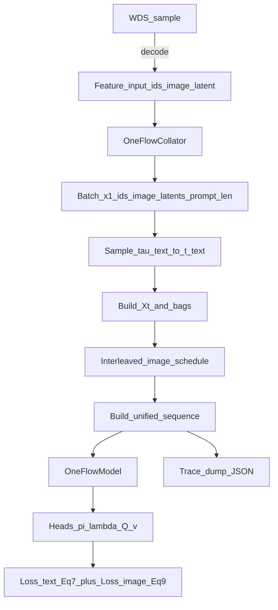

# OneFlow 归零式验证手册（从零排查：Text → Image → Mixed → Interleaved）

本手册的目标是：把 OneFlow 的训练/采样链路拆成**可验证的、阶段化的**小步骤，配套**单元测试 + 产物（trace/json/png/metrics）**，从而定位任何可能的实现偏差或 bug（尤其是 *unified sequence 拼接*）。

论文参考：[arXiv:2510.03506](https://arxiv.org/html/2510.03506)

本仓库已落地的论文规格摘录：`/mnt/ai4s/zhangjinouwen/Project/dllm/oneflow/dllm/doc/oneflow/design/oneflow_paper_spec_2510_03506.md`

相关文档：
- 设计总览（算法与结构）：`/mnt/ai4s/zhangjinouwen/Project/dllm/oneflow/dllm/doc/oneflow/design/oneflow_design_zh.md`
- 代码对齐审计（Trainer/Sampler）：`/mnt/ai4s/zhangjinouwen/Project/dllm/oneflow/dllm/doc/oneflow/validation/oneflow_paper_alignment_audit_2510_03506.md`

---

## 总览：数据流与验证点



你在排查 bug 时，只需要问自己一个问题：**是哪一条边开始“偏离预期”？**  
每个 Stage 都会把输入/输出/不变量写死，并给出“失败时下一步看哪里”。

---

## Stage 0：数据与 latent 约定验收（先排除 dataset 干扰）

### 0.1 目标
- WDS 里的 `npy` latents 能正确 decode 成图（图像内容合理）
- `latent_scale` 一致（默认 0.18215）
- latent flatten/unflatten 约定一致（`[4,H,W]` / `[H,W,4]` / `[N,4]` 都能落到统一的 `[N,4]`）

### 0.2 输入 → 输出
- **输入**：某个 WebDataset shards 目录（包含多个 `.tar`）
- **输出产物**：
  - `*.png`（GT 解码图）
  - `*.txt`（caption）
  - `manifest.jsonl`（记录 key、latent shape、decode HW 等）

### 0.3 推荐命令
使用现有脚本：`/mnt/ai4s/zhangjinouwen/Project/dllm/oneflow/dllm/scripts/oneflow/verify_wds_latents_decode.py`（会输出 `*.png/*.txt/manifest.jsonl`）

**模板 A（快速抽样检查，推荐先跑）**

```bash
cd /mnt/ai4s/zhangjinouwen/Project/dllm/oneflow/dllm

python -u scripts/oneflow/verify_wds_latents_decode.py \
  --shards "/mnt/ai4s/zhangjinouwen/Project/dllm/oneflow/dllm/data/latents_128_bundle/wds_latents_flower32" \
  --output_dir "data/vis/gt_decode_check" \
  --vae_id_or_path "stabilityai/sd-vae-ft-mse" \
  --latent_scale 0.18215 \
  --latent_h 16 --latent_w 16 \
  --max_samples 16
```

**模板 B（只查指定 key；建议直接指定包含该 key 的单个 tar，加速定位）**

```bash
cd /mnt/ai4s/zhangjinouwen/Project/dllm/oneflow/dllm

python -u scripts/oneflow/verify_wds_latents_decode.py \
  --shards "/mnt/ai4s/zhangjinouwen/Project/dllm/oneflow/dllm/data/latents_128_bundle/wds_latents_flower32/shard-000005.tar" \
  --output_dir "data/vis/gt_decode_000070352" \
  --sample_key 000070352 \
  --vae_id_or_path "stabilityai/sd-vae-ft-mse" \
  --latent_scale 0.18215 \
  --latent_h 16 --latent_w 16 \
  --max_samples 1 --overwrite
```

**模板 C（离线环境：VAE 只从本地读取）**

```bash
cd /mnt/ai4s/zhangjinouwen/Project/dllm/oneflow/dllm

python -u scripts/oneflow/verify_wds_latents_decode.py \
  --shards "/path/to/wds_latents_dir_or_tar" \
  --output_dir "data/vis/gt_decode_offline" \
  --vae_id_or_path "/path/to/local/sd-vae-ft-mse" \
  --local_files_only \
  --latent_h 16 --latent_w 16 \
  --max_samples 16
```

### 0.4 必须满足的不变量（Fail 就先别调训练/采样）
- `npy` 能被读出，shape ∈ `{[4,H,W], [H,W,4], [N,4]}` 且 `dim_latent=4`
- reshape 到 `[1,4,H,W]` 后，`lat /= latent_scale`，VAE decode 不报错
- 图像像“图”（非纯噪声/全黑/全白）；caption 和内容至少弱相关

---

## Stage 1：纯文本（text-only）正确性

### 1.1 目标

验证离散部分完全正确，并且**不依赖图像/latent**：
- `τ_text → t_text` 的采样与 token keep/noise 一致
- `X_t` 与 bag-of-tokens `A_i` 构造一致（每个“插入槽位”的缺失 token 多重集合）
- 文本损失按论文 Eq(7)：**token CE + π BCE + λ_nonzero Poisson(k>0)**（不使用 \(\\dot\\kappa/(1-\\kappa)\) reweight）
- sampler 的插入概率 `p^λ` / 可选 `p^π` 计算正确（Algorithm 2）

### 1.2 输入 → 操作 → 输出（最小可验证单元）
- **输入**：
  - 纯文本 `x1_ids`（必须以 BOS 开头，且不包含 `<|oneflow_image|>`）
  - `prompt_len`（可选；如果提供，前缀 token 强制保留）
  - scheduler：`κ(t)`（text-only 不用 inverse）
- **操作**：
  1) 采样 `τ_text` 与 `t_text`
  2) 采样 keep mask（prob=κ(t_text)），构造 `X_t` 与 `A_i`
  3) 前向得到 `π/λ_nonzero/Q`
  4) 计算 Eq(7) loss（并可单独输出 3 个分量）
- **输出**：
  - `X_t`（token 序列）
  - `A_i`（bags，长度 = `len(X_t)`）
  - `k_i = |A_i|`（每个槽位缺失计数）
  - `loss_text_total` 与 `{loss_tok, loss_pi, loss_lam}` 分量

### 1.3 不变量（必须断言）
- `len(bags) == len(X_t)`，且 `X_t[0]` 是 BOS
- `sum_i |A_i| == len(x1_ids) - len(X_t)`（删除 token 总数守恒）
- 若 `prompt_len` 给定，则 `X_t[:prompt_len]` 与 `x1_ids[:prompt_len]` 完全一致（prompt 内无删除/插入）
- `loss_pi`：
  - 对 `k_i==0` 的位置应推动 `π_i→1`
  - 对 `k_i>0` 的位置应推动 `π_i→0`
- `loss_lam`：
  - 仅在 `k_i>0` 位置生效；`k_i==0` 位置不应贡献 Poisson 项

### 1.4 可视化（位置表）
建议在 debug 时输出一份“位置表”，便于肉眼确认 bag 与 token 对齐：

| i(slot) | X_t[i] token_id | bag A_i (token_ids) | k_i |
|---:|---:|---|---:|
| 0 | BOS | [..deleted..] | 2 |
| 1 | t1  | [] | 0 |
| ... | ... | ... | ... |

### 1.5 推荐命令模板

**模板 A（Stage 1：Eq(7) 数值单测，推荐）**

```bash
cd /mnt/ai4s/zhangjinouwen/Project/dllm/oneflow/dllm
pytest -q scripts/tests/test_oneflow_text_loss_eq7.py
```

**模板 B（Stage 1：采样插入概率/右到左插入语义单测，可选）**

```bash
cd /mnt/ai4s/zhangjinouwen/Project/dllm/oneflow/dllm
pytest -q scripts/tests/test_oneflow_sampler_step.py
```

**模板 C（Stage 1：一键脚本：测试 + text-only smoke 训练，推荐给首次验收）**

```bash
cd /mnt/ai4s/zhangjinouwen/Project/dllm/oneflow/dllm

# 只跑 Stage 1 相关单测（Eq7 + sampler + Xt/bags）
bash scripts/oneflow/stage1_text_only_test.sh

# 可选：跑一个 tiny text-only smoke 训练（会输出 trace JSON 产物）
bash scripts/oneflow/stage1_text_only_train.sh \
  --output_dir data/vis/stage1_text_only_smoke \
  --max_steps 20 \
  --device cpu
```

---

## Stage 2：纯图像（image-only flow matching）正确性

### 2.1 目标
在最小文本条件下验证图像侧（不让“文本插入”掺和进来）：

- `Y_t = tY1 + (1-t)Y0` 与 `flow=Y1-Y0` 的监督逻辑正确
- `v==flow` 时 `loss_img≈0`（数值单测）
- Euler 更新 `Y += dt * v` 的切片/shape 对齐 `modality_positions`

### 2.2 输入 → 输出
- **输入**：
  - 固定 prompt：`[BOS, <|oneflow_image|>, EOS]`
  - 单张图像 latent `Y1`（shape 可为 `[4,H,W]` 或 `[N,4]`）
  - 设定 `t_img`（可固定为 0.3/0.7 之类）
- **输出**：
  - `modality_positions` 里该图像块 `(type=0, offset, length=N)`
  - `flow_targets` 与 `modality_tokens(=Y_t)` 对齐
  - `loss_img` 可预测（特别是构造 `v=flow` 的 oracle 情况）

### 2.3 不变量
- `image_num_tokens == latent_h * latent_w`（例如 128×128 → 16×16 → 256）
- flatten 约定一致（row-major）：`[4,H,W] -> [H,W,4] -> [N,4]`
- modality tokens 只出现在 `<|oneflow_image|>` token 之后，且连续 N 个

### 2.4 推荐命令模板

```bash
cd /mnt/ai4s/zhangjinouwen/Project/dllm/oneflow/dllm
pytest -q scripts/tests/test_oneflow_image_flow_matching.py
```

---

## Stage 3：mixed-modal unified sequence 拼接正确性（最关键）

### 3.1 目标
验证 unified sequence 的拼接是完全可解释且可逆的：

- `xt_to_total_pos` 映射正确（每个 `X_t` 的 text token 在 unified 序列中的位置）
- `modality_positions=(type, offset, length)` 正确且与实际插入 tokens 一致
- `is_any_modality` 与 `modality_tokens / flow_targets / times` 对齐（padding 后也对齐）

### 3.2 位置表（trace 可视化核心）
我们会在 trace 中输出一张“总位置表”（建议写到 `trace.json` 或 `trace.md`）：


| total_pos | kind | text_token_id | img_idx | mod_local_j | time | notes |
|---:|---|---:|---:|---:|---:|---|
| 0 | text | BOS | - | - | 0.0 | xt[0] |
| 1 | text | ... | - | - | 0.0 | xt[1] |
| 2 | text | <|oneflow_image|> | 0 | - | 0.0 | image anchor token |
| 3 | mod  | PAD | 0 | 0 | t_img | modality token 0 |
| 4 | mod  | PAD | 0 | 1 | t_img | modality token 1 |
| ... | ... | ... | ... | ... | ... | ... |

### 3.3 不变量（必须断言）
- `len(xt_to_total_pos) == len(X_t)` 且严格递增
- 对每个 image `(offset,length)`：
  - `is_any_modality[offset:offset+length]` 全为 True
  - `times[offset:offset+length]` 全等于该图像的 `t_img`
- 对所有 text token 位置 `pos in xt_to_total_pos`：
  - `is_any_modality[pos] == False`
  - 若 `condition_text_on_time=False`，则 `times[pos]` 恒定（默认 0.0）

### 3.4 推荐命令模板

**模板 A（训练侧 unified 拼接/映射/对齐）**

```bash
cd /mnt/ai4s/zhangjinouwen/Project/dllm/oneflow/dllm
pytest -q scripts/tests/test_oneflow_sequence_ops.py
```

**模板 B（采样侧 bs=1 unified 拼接/切片）**

```bash
cd /mnt/ai4s/zhangjinouwen/Project/dllm/oneflow/dllm
pytest -q scripts/tests/test_oneflow_sampler_step.py -k build_unified_sampler_inputs_bs1
```

---

## Stage 4：interleaved schedule（τ_img 删除/保留）正确性

### 4.1 目标
验证最易出错的“删除 + bag 合并”语义：

- `τ_img = τ_text - κ^{-1}(u)` 的删除条件
- 删除 `<|oneflow_image|>` 后：
  - 必须把该 token 放回到“前一个 slot 的 bag”
  - 并把“删除 token 后面的 bag”合并到前一个 bag（否则 bag 与 `X_t` 对不齐）

### 4.2 强制触发测试（推荐）
用固定 `τ_text` 和固定 `u` 来构造两种情形：
- **case A**：`τ_img < 0` ⇒ delete
- **case B**：`τ_img >= 0` ⇒ keep，并产生 `t_img=min(1,τ_img)`

对每个 case 输出 trace，断言 `X_t/bags/images/t_img` 与预期完全一致。

### 4.3 推荐命令模板

```bash
cd /mnt/ai4s/zhangjinouwen/Project/dllm/oneflow/dllm
pytest -q scripts/tests/test_oneflow_interleaved_schedule.py
```

---

## Stage 5：端到端（最小集成）验证

### 5.1 CPU 快速集成（强烈推荐每次改动都跑）
目标：尽量不依赖外部下载，只验证 shape/数值稳定：

- 能 forward/backward 一步
- `loss_text` 有限、`loss_img` 有限
- sampler 能输出 `images[0].shape == [image_num_tokens, dim_latent]`

### 5.2 NPU 集成（可选开关）
目标：复用 16×NPU smoke 命令，在 CI/本地按需执行。

建议用环境变量控制：

- `RUN_NPU_TESTS=1 pytest -q ...`

### 5.3 推荐命令模板

**模板 A（Stage 5：CPU 最小集成，推荐每次改动都跑）**

```bash
cd /mnt/ai4s/zhangjinouwen/Project/dllm/oneflow/dllm
pytest -q scripts/tests/test_oneflow_integration_cpu.py
```

**模板 B（Stage 5：NPU 可选集成；需先激活 Ascend 环境）**

```bash
export ASCEND_HOME=/usr/local/Ascend/ascend-toolkit/latest
source /usr/local/Ascend/ascend-toolkit/set_env.sh
source /usr/local/Ascend/nnal/atb/set_env.sh
export HCCL_NPU_SOCKET_PORT_RANGE=auto
export LD_LIBRARY_PATH=/usr/local/Ascend/driver/lib64:/usr/local/Ascend/driver/lib64/driver:/usr/local/Ascend/driver/lib64/common:$LD_LIBRARY_PATH

cd /mnt/ai4s/zhangjinouwen/Project/dllm/oneflow/dllm
RUN_NPU_TESTS=1 pytest -q scripts/tests/test_oneflow_integration_npu_optional.py
```

**模板 C（可选：16×NPU mixed-generation smoke；使用专门入口，避免把 base entry 误写成已支持所有阶段旗标）**

```bash
cd /mnt/ai4s/zhangjinouwen/Project/dllm/oneflow/dllm

accelerate launch \
  --config_file scripts/accelerate_configs/npu_ddp.yaml \
  --main_process_port 29500 \
  examples/oneflow_mixed_generation/pt_mixed.py \
  --output_dir "/path/to/ckpts/oneflow_mm_smoke" \
  --tokenizer_name_or_path "/mnt/ai4s/zhangjinouwen/Project/dllm/oneflow/dllm/data/latents_128_bundle/tokenizer" \
  --shards "/mnt/ai4s/zhangjinouwen/Project/dllm/oneflow/dllm/data/latents_128_bundle/wds_latents_flower32" \
  --use_precomputed_ids True \
  --max_steps 100 \
  --per_device_train_batch_size 1 \
  --gradient_accumulation_steps 1 \
  --dataloader_num_workers 0 \
  --mixed_generation_prob 0.2 \
  --report_to none \
  --save_strategy no \
  --logging_steps 1
```

**模板 D（可选：单 shard / 单进程 强 overfit（最快定位容量/干扰））**

```bash
cd /mnt/ai4s/zhangjinouwen/Project/dllm/oneflow/dllm

accelerate launch \
  --config_file scripts/accelerate_configs/npu_ddp.yaml \
  --num_processes 1 \
  --main_process_port 29500 \
  examples/oneflow_image_only/pt_image.py \
  --output_dir "/mnt/ai4s/zhangjinouwen/Project/dllm/oneflow/dllm/data/ckpts/oneflow_overfit_one_shard_000070352" \
  --tokenizer_name_or_path "/mnt/ai4s/zhangjinouwen/Project/dllm/oneflow/dllm/data/latents_128_bundle/tokenizer" \
  --shards "/mnt/ai4s/zhangjinouwen/Project/dllm/oneflow/dllm/data/latents_128_bundle/wds_latents_flower32/shard-000005.tar" \
  --use_precomputed_ids True \
  --max_steps 5000 \
  --per_device_train_batch_size 1 \
  --gradient_accumulation_steps 1 \
  --dataloader_num_workers 0 \
  --image_loss_weight 10 \
  --lr_scheduler_type constant --warmup_ratio 0.0 \
  --save_strategy steps --save_steps 500 --save_total_limit 20 \
  --logging_steps 10 --report_to none
```

**模板 E（可选：overfit 评估/可视化曲线）**

```bash
cd /mnt/ai4s/zhangjinouwen/Project/dllm/oneflow/dllm

python -u examples/oneflow/overfit_eval_wds.py \
  --model_dir "/mnt/ai4s/zhangjinouwen/Project/dllm/oneflow/dllm/data/ckpts/oneflow_overfit_one_shard_000070352" \
  --wds_shards "/mnt/ai4s/zhangjinouwen/Project/dllm/oneflow/dllm/data/latents_128_bundle/wds_latents_flower32/shard-000005.tar" \
  --sample_key 000070352 \
  --output_dir "/mnt/ai4s/zhangjinouwen/Project/dllm/oneflow/dllm/data/vis/overfit_trend_000070352"
```

---

## Trace JSON（统一格式，所有阶段共用）

我们会把所有关键中间态写进 JSON，便于复现与对比（同一输入、不同 checkpoint/不同实现版本）。

建议 schema（字段可增不减）：


```json
{
  "seed": 42,
  "tau_text": [[0.73]],
  "t_text": [[0.73]],
  "kappa_keep": [[0.73]],
  "x1_ids": [[1, 2, 3]],
  "prompt_len": [null],
  "xt_ids": [[1, 3]],
  "bags": [[[2], []]],
  "k_counts": [[1, 0]],
  "images": [
    {
      "img_idx": 0,
      "tau_img": 0.30,
      "t_img": 0.30,
      "deleted": false,
      "num_tokens": 256
    }
  ],
  "unified": {
    "input_ids": [[1, 999, 0, 0]],
    "is_any_modality": [[0, 0, 1, 1]],
    "times": [[0.0, 0.0, 0.3, 0.3]],
    "xt_to_total_pos": [[0, 1]],
    "modality_positions": [[[0, 2, 2]]]
  }
}
```

---

## 单元测试映射（每个 Stage 都有对应 test）

pytest 已配置：`pyproject.toml` 的 `testpaths = [\"scripts/tests\"]`


我们会新增并维护这些测试文件：

- `/mnt/ai4s/zhangjinouwen/Project/dllm/oneflow/dllm/scripts/tests/test_oneflow_sequence_ops.py`
- `/mnt/ai4s/zhangjinouwen/Project/dllm/oneflow/dllm/scripts/tests/test_oneflow_interleaved_schedule.py`
- `/mnt/ai4s/zhangjinouwen/Project/dllm/oneflow/dllm/scripts/tests/test_oneflow_text_loss_eq7.py`
- `/mnt/ai4s/zhangjinouwen/Project/dllm/oneflow/dllm/scripts/tests/test_oneflow_image_flow_matching.py`
- `/mnt/ai4s/zhangjinouwen/Project/dllm/oneflow/dllm/scripts/tests/test_oneflow_sampler_step.py`
- `/mnt/ai4s/zhangjinouwen/Project/dllm/oneflow/dllm/scripts/tests/test_oneflow_wds_minishard.py`

运行方式：


```bash
pytest -q scripts/tests/test_oneflow_*.py
```

如果你在纯 CPU 环境遇到 `torch_npu` 自动加载报错，可在运行 pytest 前加：

```bash
export TORCH_DEVICE_BACKEND_AUTOLOAD=0
```
